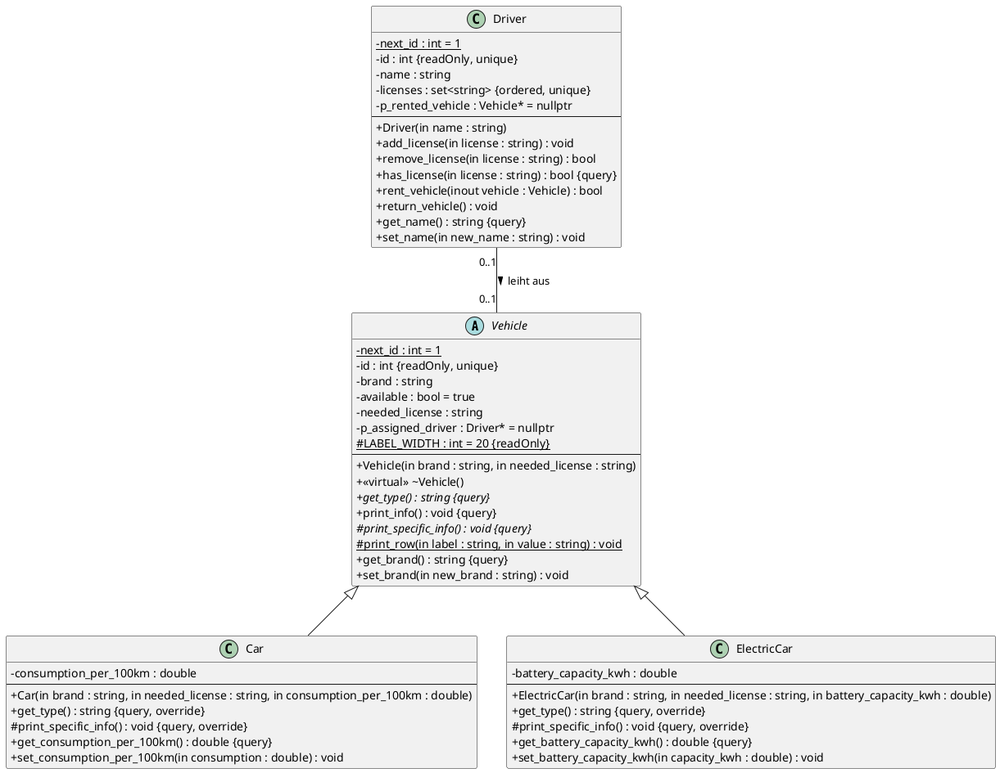

# Musterlösung – Probeklausur Flottenmanagementsystem (Prof. Braunagel)

> Inoffizielle Musterlösung, nicht vom Prof. Der Code liegt in diesem Ordner und wurde mit
> `g++ -std=c++17 -Wall -Wextra -pedantic *.cpp` ohne Warnungen kompiliert. Die Ausgabe
> entspricht genau den Beispielen im Aufgabenblatt.

## a) UML-Klassendiagramm

Darstellung in PlantUML-Syntax. Du kannst sie in draw.io nachzeichnen oder mit der
VS-Code-Extension „PlantUML“ rendern.

### Worauf der Prof bei a) achtet (Checkliste aus der Aufgabenstellung)

| Gefordert | Wie man es darstellt |
|---|---|
| Sichtbarkeiten | `+` public, `-` private, `#` protected |
| Datentypen | `name : string`, Rückgabetyp hinter `:` |
| **konstant** | `{readOnly}` hinter dem Attribut, z.B. die ID. Konstante Methoden bekommen `{query}`. |
| **statisch** | unterstrichen (in PlantUML `{static}`) |
| **abgeleitet** | `/` vor dem Namen, z.B. `/ is_rented : bool` (wird aus `p_rented_vehicle != nullptr` berechnet). Optional. |
| **eindeutig** | `{unique}` an der ID. Bei der Lizenz-Menge passen `{ordered, unique}`, weil ein `std::set` sortiert ist und keine Duplikate hat. |
| **virtuell / abstrakt** | abstrakte Klasse und Methoden *kursiv* oder mit `{abstract}`. `override` als Eigenschaft ist optional, aber schön. |
| Parameterrichtungen | `in` (wird nur gelesen, in C++ `const&` oder per Wert), `inout` (wird verändert, `&`), `out` |
| Navigierbarkeit | Pfeilspitzen. Hier ist die Beziehung **bidirektional**: Das Fahrzeug kennt seinen Fahrer, weil `print_info` ihn ausgibt, und der Fahrer kennt sein Fahrzeug. Beide Enden bekommen eine Pfeilspitze oder keine. |
| Multiplizität | Ein Fahrer leiht **0..1** Fahrzeug aus, ein Fahrzeug hat **0..1** Fahrer |
| Beziehungsname | „leiht aus ▶“ mit Leserichtung |

**Assoziation, nicht Aggregation oder Komposition:** Fahrer und Fahrzeug existieren
unabhängig voneinander, und keiner ist „Teil“ des anderen. Deshalb sind es im Code
**nicht-besitzende** Zeiger.

## b) Wichtige Implementierungsdetails, die man leicht vergisst

1. **`static int next_id` in der `.cpp` definieren** (`int Driver::next_id = 1;`), sonst gibt es einen Linkerfehler.
2. **`const int id` in der Initialisierungsliste setzen.** Das ist die Umsetzung von „ID nur einmalig setzbar“, und deshalb gibt es auch **keinen Setter** für die ID.
3. **Kopieren verbieten** (`= delete`), denn eine Kopie hätte dieselbe „eindeutige“ ID.
4. **Container für die Lizenzen:** `std::set<std::string>`, weil er geordnet ist, keine Duplikate zulässt und `find()` mitbringt. Ein `std::vector` mit `std::find` gibt wahrscheinlich auch Punkte, ist aber schwächer begründbar.
5. **Neue Fahrzeuge:** `available = true` und `p_assigned_driver = nullptr` im Konstruktor (steht explizit in der Aufgabe!).
6. **Gegenseitige Bekanntschaft:** In den Headern stehen Forward Declarations (`class Driver;`), das echte `#include` kommt erst in die `.cpp`. Sonst entsteht ein zirkuläres Include.
7. **`rent_vehicle` prüft alle drei Bedingungen** und setzt danach *beide* Seiten: `p_rented_vehicle`, `assigned_driver` und `available = false`.
8. **Tabellenausgabe:** `std::left << std::setw(20)`. Die Zeile, die vom Typ abhängt, steht in der Mitte der Tabelle. Deshalb ruft das nicht-virtuelle `print_info()` die virtuelle Methode `print_specific_info()` auf (Template Method), und der Code für die gemeinsamen Zeilen wird nicht dupliziert. Das bringt Punkte für „wiederverwendbar und erweiterbar“.
9. **Virtueller Destruktor** in `Vehicle`.

## c) `main`

- `std::vector<std::unique_ptr<Vehicle>>`: Weil `Vehicle` abstrakt ist, geht `vector<Vehicle>` gar nicht. Bei einer konkreten Basisklasse gäbe es außerdem Slicing.
- `std::vector<std::unique_ptr<Driver>>`: Hier steckt eine **Falle**. Mit `vector<Driver>` könnten sich die Adressen ändern, wenn der Vector wächst (Reallokation), und die Zeiger in `Vehicle` würden ins Leere zeigen. Durch die gelöschte Kopie würde es außerdem gar nicht kompilieren.
- Die Schleife gibt über einen Basisklassenzeiger aus: `Vehicle* p_base = p_vehicle.get(); p_base->print_info();`

## e) Frage

Die Antwort steht als Kommentar in `main.cpp`. Kurz gesagt: Die Methode ist in der Basisklasse `virtual` und in der abgeleiteten Klasse mit **`override`** gekennzeichnet. Dann prüft der Compiler, ob die Signatur exakt übereinstimmt. Zusätzlich gibt es `final` und den virtuellen Destruktor.

## Vergleich mit deiner `fia.hpp`-Übung

Die gleichen Punkte gelten auch dort: leere `print()`-Overrides, fehlendes `const` bei Gettern,
`new` ohne `delete`, kein Kopierschutz bei eindeutiger ID, und rohe Zeiger auf
Objekte, deren Lebensdauer niemand garantiert.
