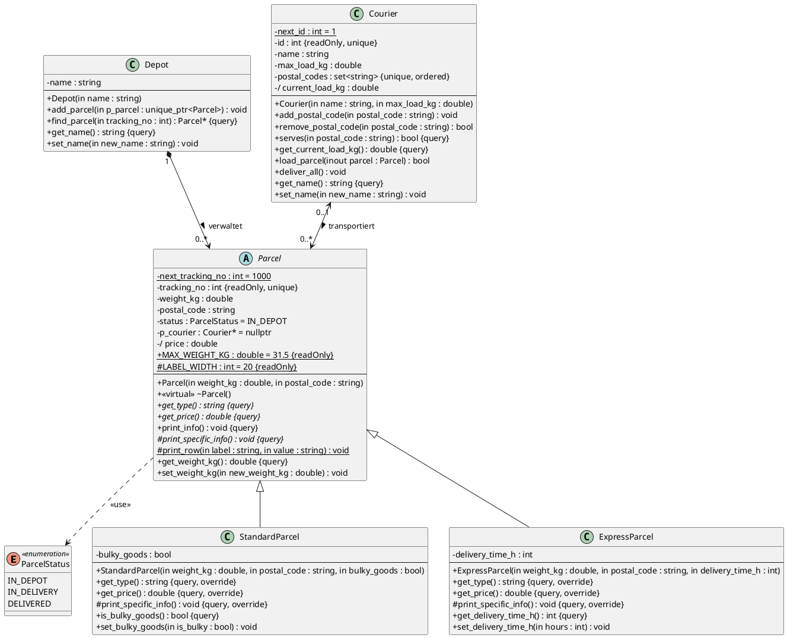

# Musterlösung – Probeklausur 01 „Paketzustelldienst“

> Erst öffnen, wenn du fertig bist! Der Code in diesem Ordner wurde mit
> `g++ -std=c++17 -Wall -Wextra -pedantic *.cpp` ohne Warnungen kompiliert. Die Ausgabe
> entspricht den Beispielen im Aufgabenblatt.

## a) UML-Klassendiagramm

**Abgeleitete Attribute** (`/price`, `/current_load_kg`) werden im UML mit `/` markiert. Im Code
sind sie **keine Member-Variablen**, sondern werden in `get_price()` bzw.
`get_current_load_kg()` berechnet. Das verlangt die Aufgabe ausdrücklich mit „nicht gespeichert“.

**Beziehungen**

| Beziehung | Art | Navigierbarkeit | Multiplizität | Warum |
|---|---|---|---|---|
| Depot – Parcel | **Komposition** (gefüllte Raute am Depot) | Depot → Parcel | 1 zu 0..* | „Wird ein Depot aufgelöst, werden auch alle Pakete gelöscht“ |
| Courier – Parcel | **Assoziation** | bidirektional (`p_courier` ↔ `loaded_parcels`) | 0..1 zu 0..* | Der Zusteller transportiert die Pakete, besitzt sie aber nicht. Das Paket gibt seinen Zusteller in `print_info` aus. |
| Standard/Express – Parcel | Vererbung | – | – | „ist ein“ Paket |

`loaded_parcels` steht nicht als Attribut in der Klasse, weil es durch das Assoziationsende
dargestellt wird. Beides gleichzeitig wäre doppelt. Viele Profs akzeptieren aber beides.

## b) Details, die oft vergessen werden

1. `static int next_tracking_no` in der .cpp definieren. `const int tracking_no` wird in der Initialisierungsliste gesetzt und hat **keinen Setter**.
2. Kopierkonstruktor und Zuweisung mit `= delete` verbieten, wegen der eindeutigen ID.
3. `enum class ParcelStatus` ist der „typsichere Datentyp“ für den Status. Ein `int` oder `string` wäre nicht typsicher.
4. Konstruktor: `status = IN_DEPOT`, `p_courier = nullptr` (wird ausdrücklich verlangt).
5. Gewicht validieren und eine Exception werfen, auch im **Setter**, sonst lässt sich die Prüfung umgehen.
6. `std::set<std::string>` für die PLZ: Man kann darin suchen (`find`), und es gibt keine Duplikate.
7. `load_parcel` prüft **alle drei** Bedingungen. Die Bedingung „Paket ist im Depot“ verhindert, dass ein Paket doppelt geladen wird. Danach werden beide Seiten der Assoziation **und** der Status gesetzt.
8. `deliver_all` leert nur die Liste und löscht keine Pakete (Assoziation!).
9. Forward Declarations in den Headern (`class Courier;` / `class Parcel;`), weil sich die Klassen gegenseitig kennen.
10. Die Preisberechnung nutzt Konstanten statt magischer Zahlen (Coding Convention).
11. Template Method: Das nicht-virtuelle `print_info()` ruft das virtuelle `print_specific_info()` auf. So wird der gemeinsame Teil der Tabelle nicht dupliziert („wiederverwendbar und erweiterbar“).

## c) `main`

- Die Pakete liegen im Depot als `vector<unique_ptr<Parcel>>`, die Zusteller als `vector<unique_ptr<Courier>>`. Weil die Objekte auf dem Heap liegen, bleiben die rohen Zeiger zwischen Parcel und Courier gültig, auch wenn der Vector wächst.
- Die Ausgabe läuft in einer Schleife über `const Parcel* p_base`.
- Abgelehntes Laden: falsche PLZ, Paket schon geladen, zu schwer. Exception: 40 kg.

## e) Fragen

Siehe Kommentar oben in `main.cpp`.

## Bewertungsschema (eigene Schätzung, keine offiziellen Punkte)

| Teil | Punkte |
|---|---|
| a) UML: Klassen, Attribute, Typen (8), Sichtbarkeiten (3), static/readOnly/unique/abgeleitet/abstract (6), Parameterrichtungen (3), Beziehungen mit Art, Navigierbarkeit, Multiplizität und Name (10) | 30 |
| b) Klassenhierarchie und abstrakte Klasse (8), ID-Mechanismus (4), Preisberechnung (6), `print_info`-Tabelle (6), Courier mit set und Ladelogik (12), Depot mit Komposition (6), Exceptions (4), Getter/Setter und `const` (6), Coding Convention (4) | 56 |
| c) `main` mit allen geforderten Fällen | 10 |
| d) kompiliert fehlerfrei | Voraussetzung |
| e) zwei Fragen | 4 |
| **Summe** | **100** |
